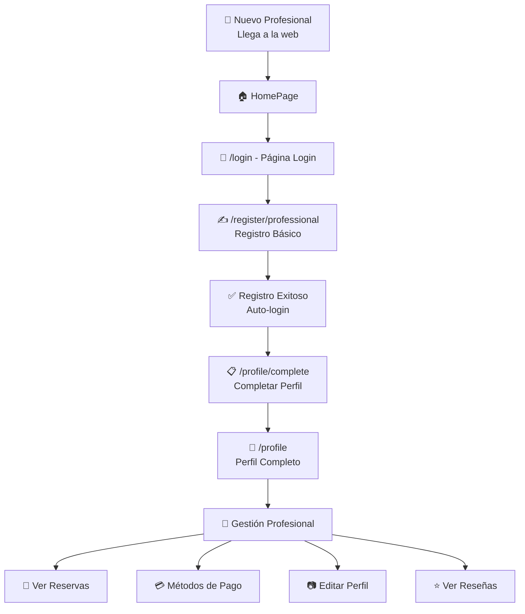

# 🎯 Flujo del Profesional - SoloClick

## 📱 **Navegación Completa del Profesional**



## 🔄 **Etapas del Registro**

### **ETAPA 1: Registro Básico** (`/register/professional`)
```tsx
📝 Datos requeridos:
• Nombre completo
• Email  
• Contraseña
• Teléfono
• Ciudad
• Especialidad (dropdown)

🎯 Al completar → Auto-login + Redirige a /profile/complete
```

### **ETAPA 2: Completar Perfil** (`/profile/complete`)
```tsx
📋 Información detallada:
• Descripción de servicios (textarea)
• Dirección completa del negocio
• Horarios de trabajo (7 días)
  - Lunes: 09:00 - 18:00
  - Martes: 09:00 - 18:00
  - etc...
• Imágenes del trabajo (múltiples)

🎯 Al completar → Redirige a /profile
```

### **ETAPA 3: Perfil Activo** (`/profile`)
```tsx
💼 Gestión completa:
• Ver información del perfil
• Editar datos personales
• Gestionar métodos de pago destacados (máx 3)
• Ver reservas de clientes
• Gestionar horarios y disponibilidad
• Ver estadísticas y reseñas
```

## 🛠️ **Funcionalidades por Página**

### **CompleteProfilePage.tsx**
```tsx
CARACTERÍSTICAS:
✅ Formulario de descripción profesional
✅ Campo de dirección completa
✅ Selector de horarios por día
✅ Subida de imágenes
✅ Validación de campos
✅ Estado de carga
✅ Redirección automática

CONEXIÓN BACKEND:
• profileService.updateProfile() 
• profileService.uploadImages()
• Guarda en MongoDB con profileCompleted = true
```

### **ProfilePage.tsx**
```tsx
CARACTERÍSTICAS:
✅ Vista completa del perfil profesional
✅ Métodos de pago destacados (máx 3)
✅ Edición de información personal
✅ Navegación a otras secciones

PRÓXIMAS FUNCIONALIDADES:
🔲 Ver reservas de clientes
🔲 Gestionar disponibilidad
🔲 Ver reseñas y calificaciones
🔲 Estadísticas de negocio
```

## 💾 **Persistencia de Datos**

### **Frontend (localStorage)**
```javascript
// Datos que se guardan localmente:
• JWT token (auth)
• Información del usuario logueado
• Profesionales favoritos
• Métodos de pago destacados (máx 3)
```

### **Backend (MongoDB)**
```javascript
// Esquema Professional extendido:
{
  // Datos básicos (Etapa 1)
  name: String,
  email: String,
  password: String,
  phone: String, 
  city: String,
  specialty: String,
  
  // Datos completados (Etapa 2)
  description: String,
  address: String,
  workingHours: {
    monday: { open: String, close: String },
    tuesday: { open: String, close: String },
    // ... resto de días
  },
  images: [String],
  profileCompleted: Boolean, // true después de Etapa 2
  
  // Metadatos
  createdAt: Date,
  updatedAt: Date
}
```

## 🔐 **Autenticación y Seguridad**

```tsx
FLUJO DE AUTH:
1. Register → JWT token generado
2. Auto-login → Token guardado en localStorage  
3. Interceptor axios → JWT en todas las requests
4. Verificación → authService.isAuthenticated()
5. Rutas protegidas → Redirect si no autenticado
```

## 🎨 **Experiencia de Usuario**

### **Navegación Intuitiva**
- ✅ Pasos claros y secuenciales
- ✅ Validación en tiempo real
- ✅ Mensajes informativos
- ✅ Redirecciones automáticas

### **Diseño Responsivo**
- ✅ Funciona en móvil y desktop
- ✅ Formularios optimizados
- ✅ Imágenes de fondo atractivas
- ✅ Estados de carga visibles

## 🚀 **Próximos Pasos**

### **Etapa 3: Gestión de Servicios** (Pendiente)
```tsx
📋 Funcionalidades a implementar:
• Crear/editar servicios ofrecidos
• Definir precios por servicio
• Gestionar disponibilidad por servicio
• Sistema de reservas avanzado
• Panel de estadísticas
• Chat con clientes
```

### **Backend Integration**
```typescript
🔧 Endpoints necesarios:
• PUT /professionals/profile
• GET /professionals/profile  
• POST /professionals/upload-images
• GET /professionals/reservations
• PUT /professionals/availability
```